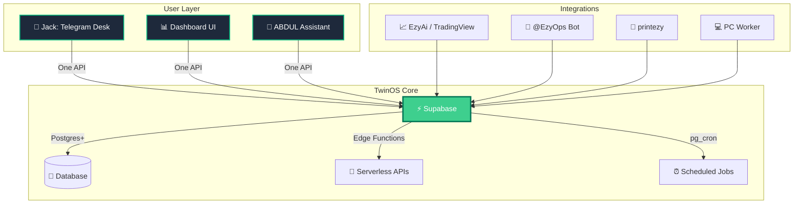
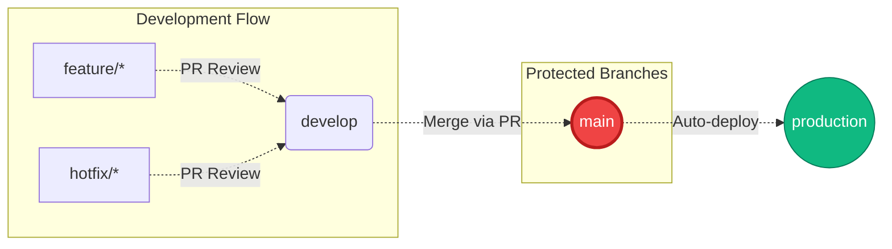

<!-- @dsCard group="TwinOS" -->
<p align="center">
  <picture>
    <source media="(prefers-color-scheme: dark)" srcset="https://img.shields.io/badge/TwinOS-EzyMap's%20Operating%20System-10b981?style=for-the-badge&logo=linux&logoColor=white&labelColor=0f172a&color=059669">
    <source media="(prefers-color-scheme: light)" srcset="https://img.shields.io/badge/TwinOS-EzyMap's%20Operating%20System-10b981?style=for-the-badge&logo=linux&logoColor=black&labelColor=f0fdf4&color=047857">
    
  </picture>
</p>

<p align="center">
  🤖 AI-Powered Telegram Channel Automation for Gold Trading
  
  <a href="https://github.com/printezy247/TwinOS-helper-system/actions/workflows/ci.yml"></a>
  <a href="https://supabase.com/dashboard/project/cdnyybrfoclexjlroqcf"></a>
  <a href="https://github.com/printezy247/TwinOS-helper-system/blob/main/LICENSE"></a>
  <a href="https://github.com/printezy247/TwinOS-helper-system/releases"></a>
</p>

---

<div align="center">

**Status:** 🟡 **Phase 0** (Plan & Mind) | October 2026

[📖 Documentation](#-documentation) • 
[🏗️ Architecture](#-architecture-overview) • 
[⚙️ Setup](docs/SETUP.md) • 
[🎯 Roadmap](docs/PHASES.md) • 
[💫 Upgrade Ideas](docs/UPGRADE-IDEAS.md)

</div>

---

## 🌟 Overview

TwinOS orchestrates the **EzyMap gold-trading Telegram channel**, automating content creation, compliance checking, scheduled publishing, and analytics—so Jack can focus on maps, TikTok, and community.



### ✨ Key Features

| Feature | Status | Description |
|---------|--------|-------------|
| 📝 **Smart Drafting** | Phase 0 | Pull from Posting Kit templates automatically |
| ✅ **Compliance Check** | Phase 0 | Validate posts against strict checklist |
| 🎯 **One-Tap Publish** | Phase 0 | Jack approves, system schedules |
| 📊 **Signal Tracking** | Phase 0 | Auto-reply under signal posts |
| 👥 **Member Analytics** | Phase 0 | Track growth via allowed methods only |
| 🏆 **Friday Scoreboard** | Phase 0 | Automated weekly performance reports |

---

## 📁 Project Structure

```bash
TwinOS-helper-system/
├── supabase/
│   ├── migrations/          # Schema, RLS, triggers, mint_api_key() ──► [migrations agent]
│   ├── seed.sql             # Settings, products, brand facts, templates ──► [seed agent]
│   ├── functions/
│   │   ├── _shared/         # Auth, roles, idempotency, Telegram client, compliance ──► [scaffold]
│   │   ├── content/         # Draft generation
│   │   ├── approve/         # Approval workflow
│   │   ├── publish/         # Scheduled publishing
│   │   ├── tg-webhook/      # Telegram inbound events
│   │   ├── tv-webhook/      # TradingWeb notifications
│   │   ├── signals-ingest/  # Signal data extraction
│   │   ├── results/         # Performance tracking
│   │   ├── health/          # System health checks
│   │   ├── friday/          # Weekly scoreboard
│   │   ├── jobs/            # Cron job runner
│   │   └── links/           # Link management
│   └── config.toml          # Supabase configuration
├── workers/
│   └── pc/                  # Python worker: drop folder, CSV backup, clips ──► [scaffold]
├── bots/
│   └── ops/                 # @EzyOps_bot setup & webhook flow ──► [scaffold]
├── apps/
│   └── dashboard/           # Lovable-generated dashboard (GitHub sync) ──► [Lovable]
├── apps/mcp/                # TwinOS MCP server for ABDUL ──► [mcp agent, Phase 2]
├── docs/                    # Runbooks, contracts, specifications
├── tests/                   # Unit & integration tests
├── scripts/                 # Deployment & utility scripts
├── .github/workflows/       # CI/CD pipelines
└── LICENSE                  # MIT License
```

### 🗂️ Repository Layout Table

| Path | Purpose | Owner |
|------|---------|-------|
| `supabase/migrations/` | Database schema, RLS policies, triggers | Migration Agent |
| `supabase/seed.sql` | Initial data, templates, hooks | Seed Agent |
| `supabase/functions/_shared/` | Core utilities (auth, compliance, Telegram) | Scaffold |
| `supabase/functions/<fn>/` | Individual Edge Function endpoints | Scaffold |
| `workers/pc/twinos_worker.py` | Local PC Python worker (no exposed ports) | Scaffold |
| `workers/pc/test_worker.py` | Worker test suite | Scaffold |
| `bots/ops/` | @EzyOps_bot configuration & deployment | Scaffold |
| `apps/dashboard/` | User-facing dashboard (generated by Lovable) | Lovable |
| `apps/mcp/` | MCP protocol integration for ABDUL | MCP Agent |
| `tests/` | Comprehensive test coverage | — |
| `scripts/*.sh` | Automation scripts (deploy, keys, desk-tour) | — |
| `.github/workflows/ci.yml` | CI: Deno check/lint/tests, Python unittest | — |

---

## 📚 Documentation

<div align="center">

| Document | Description |
|----------|-------------|
| [`SETUP.md`](docs/SETUP.md) | Phased setup guide (Jack-only commands) |
| [`ARCHITECTURE.md`](docs/ARCHITECTURE.md) | System shape + 11 Edge Functions |
| [`API.md`](docs/API.md) | Endpoints with request/response examples |
| [`PHASES.md`](docs/PHASES.md) | Phase-by-phase implementation checklist |
| [`UPGRADE-IDEAS.md`](docs/UPGRADE-IDEAS.md) | Research-driven enhancements (Wave 5) |
| [`LOVABLE-KNOWLEDGE.md`](docs/LOVABLE-KNOWLEDGE.md) | Lovable project knowledge base |
| [`UPGRADE-PLAN.md`](UPGRADE-PLAN.md) | Full development roadmap (v3.1) |
| [`bots/ops/README.md`](bots/ops/README.md) | @EzyOps_bot operational guide |
| [`workers/pc/README.md`](workers/pc/README.md) | PC worker documentation |

</div>

---

## ⚖️ Immutable Rules

These rules are non-negotiable and govern all TwinOS operations:

<div align="center">

| Rule | Enforcement |
|------|-------------|
| 🔒 **Approve is Jack only** | Dashboard requires his login or Desk group Telegram ID; ABDUL cannot approve |
| 🗄️ **Schema first** | Lovable never creates tables; UI always calls functions |
| 🔐 **No secrets in files** | Tokens → Supabase function secrets; machine keys hashed in `api_keys`; Jack's copies in keyring (`secret-tool`) |
| ✅ **Allowed methods only** | Bot API, official APIs, Telechurn reports, manual entry — no personal automation, scraping, or group text AI |
| 🎭 **Demo/shadow signals private** | Never reach public posts |

</div>

---

## 🧪 Local Verification

Run these commands before committing changes:

```bash
# TypeScript validation (edge functions)
cd supabase/functions && \
  deno check --config deno.json _shared/*.ts */index.ts && \
  deno test --allow-env _shared/

# Python unit tests (PC worker)
cd workers/pc && python3 -m unittest -v

# Secret key rotation checks
./scripts/mint-keys.sh --verify

# Desk tour validation
./scripts/desk-tour.sh --dry-run

# Desk report testing
python3 -m pytest tests/test_desk_report.py -v
```

---

## 🔄 Development Workflow

### Branch Protection Strategy



### PR Guidelines

1. **Create feature branch** from `develop`
2. **Implement changes** with test coverage
3. **Run local checks** (see above)
4. **Open Pull Request** targeting `develop`
5. **Await review** from designated reviewers
6. **Merge to develop** after approval
7. **Deploy via script**: `./scripts/deploy.sh`

> ⚠️ **Warning:** Direct push to `main` requires sandbox bypass. Always use PR workflow.

---

## 🛠️ Tooling Stack

| Category | Tools |
|----------|-------|
| **Backend** | Supabase Postgres, Edge Functions (Deno), pg_cron |
| **Frontend** | Lovable (TypeScript + Tailwind + shadcn/ui) |
| **Automation** | Python workers, Telechurn API, Telegram Bot API |
| **Testing** | Deno Test, Python unittest, Pytest |
| **CI/CD** | GitHub Actions, Supabase CLI |
| **Monitoring** | Action logs, Error tracking, Health checks |

---

## 📊 Project Metrics

<div align="center">

| Metric | Value |
|--------|-------|
| **Languages** | TypeScript, Python, SQL |
| **Framework** | Supabase, Lovable |
| **Primary** | Backend (Python + Deno) |
| **Tests** | Unit + Integration |
| **License** | MIT |

</div>

---

## 🚀 Quick Start

### Prerequisites

- Supabase account (Jack's project: `cdnyybrfoclexjlroqcf`)
- Node.js v22+ (for Deno edge functions)
- Python 3.12+ (for PC worker)
- GitHub account (for TwinOS repo access)

### Installation Steps

See [`docs/SETUP.md`](docs/SETUP.md) for the complete phased installation guide.

**TL;DR:**

```bash
# Clone repository
git clone https://github.com/printezy247/TwinOS-helper-system.git
cd TwinOS-helper-system

# Install Supabase CLI
npm install -g supabase

# Initialize local dev environment
supabase link --project-ref cdnyybrfoclexjlroqcf

# Start local services
supabase start

# Run tests
./scripts/run-all-tests.sh
```

---

## 💡 Contributing

This repository is actively maintained by Jack. For contributions:

1. Open an issue describing the enhancement or bug
2. Fork the repository
3. Create a feature branch
4. Submit a pull request

For major changes, please read [`docs/UPGRADE-IDEAS.md`](docs/UPGRADE-IDEAS.md) first to align with the vision.

---

## 📄 License

MIT License — see [`LICENSE`](LICENSE) for details.

---

<div align="center">

Made with ❤️ by Jack for EzyMap trading operations

**Powered by** [Supabase](https://supabase.com) · [Lovable](https://lovable.dev) · [GitHub Actions](https://github.com/features/actions)

[](https://github.com/printezy247/TwinOS-helper-system/stargazers)
[](https://github.com/printezy247/TwinOS-helper-system/watchers)
[](https://github.com/printezy247/TwinOS-helper-system/fork)

</div>
